**Nombres:** Katherin Juliana Moreno Carvajal, Mariana Salas Gutiérrez

# 1. Descripción

El presente proyecto implementa una arquitectura basada en microservicios instrumentados con OpenTelemetry, cuyo objetivo principal es garantizar observabilidad completa de extremo a extremo sobre las solicitudes HTTP realizadas entre servicios distribuidos.

El sistema está compuesto por dos microservicios desarrollados con Spring Boot:

* **food-service:** recibe las peticiones HTTP del cliente, realiza validaciones y consume otro microservicio.
* **db-service:** consulta e inserta información en PostgreSQL.

El flujo principal implementado es el siguiente:

* El usuario realiza una petición HTTP al food-service.
* El food-service procesa y valida la solicitud.
* El food-service llama al db-service.
* El db-service consulta PostgreSQL.
* Toda la comunicación queda registrada con el mismo TraceId.
* Los spans y métricas son exportados mediante OpenTelemetry Collector.

# 2. Tecnologías utilizadas

## 2.1. Backend

  * Java 17
  * Spring Boot
  * Maven
  * Spring Web
  * Spring JDBC
  * Base de datos
  * PostgreSQL

## 2.2. Observabilidad

  * OpenTelemetry Java Agent
  * OpenTelemetry SDK
  * OpenTelemetry Collector
  * Jaeger
  * New Relic

## 2.3. Infraestructura

* Docker
* Docker Compose

# 3. Flujo distribuido de una petición

Usuario -> food-service -> db-service -> PostgreSQL

 # 4. Estructura del proyecto

```
Observabilidad/
│
├── food-service/
│   ├── application/
│   ├── domain/
│   ├── infrastructure/
│   │   ├── client/
│   │   ├── controller/
│   │   └── telemetry/
│   └── Dockerfile
│
├── db-service/
│   ├── application/
│   ├── domain/
│   ├── infrastructure/
│   │   ├── controller/
│   │   ├── repository/
│   │   └── telemetry/
│   └── Dockerfile
│
├── postgres/
│   └── init.sql
│
├── otel-collector-config.yaml
│
├── docker-compose.yml
│
└── README.md
```
# 5. Preguntas

## 5.1. ¿Dónde inició el request?

El request inició en el microservicio `food-service`, específicamente en el endpoint:

```http
GET /comidas
```

Esto se evidencia tanto en los logs como en Jaeger, donde el primer span de la traza corresponde al `food-service`. Además, en los logs se observa:

```plaintext
REQUEST ENTRÓ A FOOD-SERVICE
```

Posteriormente, el `food-service` realiza una llamada HTTP al `db-service`, manteniendo el mismo `TraceId` durante toda la petición distribuida.

### Evidencia funcional en Postman

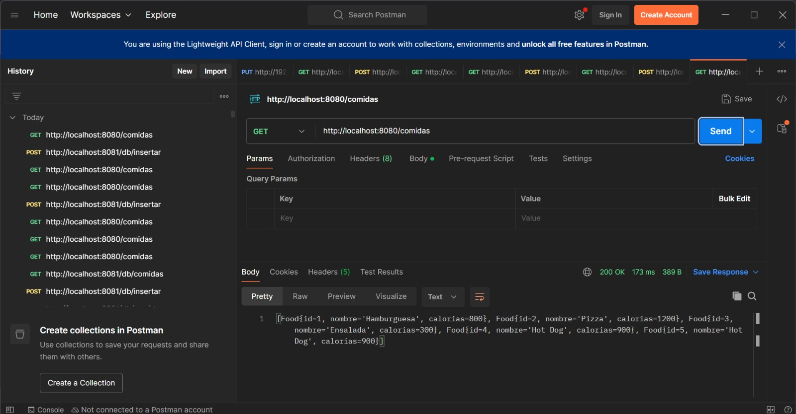

En Postman se ejecutó el endpoint `GET http://localhost:8080/comidas`, obteniendo respuesta `200 OK` en `173 ms`. La respuesta incluye los registros de comidas almacenados en la base de datos, lo cual confirma que el request inicia correctamente en `food-service`.

### Evidencia en Jaeger

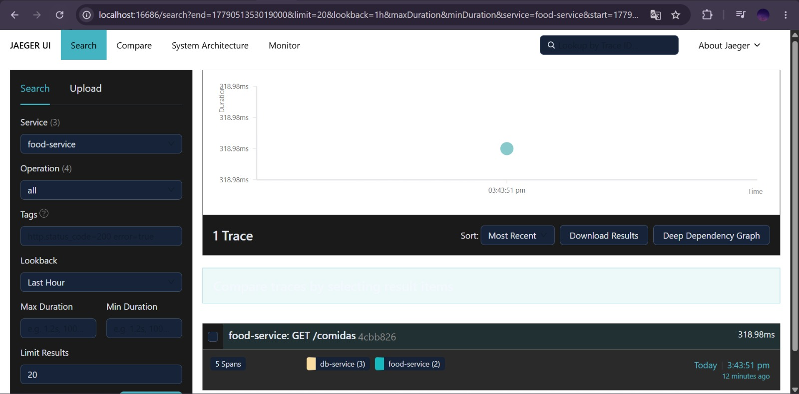

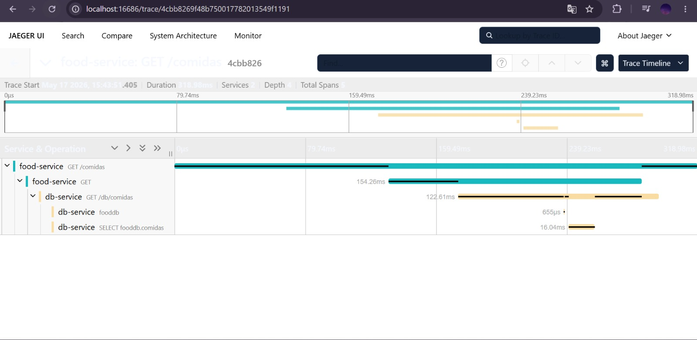

En Jaeger se observa que la traza inicia en `food-service` con la operación `GET /comidas`. La traza tiene una duración total de `318.98 ms`, contiene `5 spans` y participan los servicios `food-service` y `db-service`. Esto confirma que el request se propagó correctamente entre los microservicios.

---

## 5.2. ¿Cuál servicio tardó más?

El servicio que presentó mayor tiempo dentro de la traza distribuida fue `food-service`, ya que es el servicio que recibe la petición inicial, ejecuta la lógica principal y realiza la llamada HTTP hacia `db-service`.

En Jaeger se observó la siguiente traza para `GET /comidas`:

```plaintext
Duración total de la traza: 318.98 ms
food-service GET: 154.6 ms
db-service GET /db/comidas: 122.6 ms
SELECT fooddb.comidas: 16.04 ms
```

Por lo tanto, aunque `db-service` participa en la consulta a base de datos, el mayor tiempo observado dentro del flujo corresponde al procesamiento y comunicación desde `food-service`.

### Evidencia en Jaeger


### Evidencia de logs

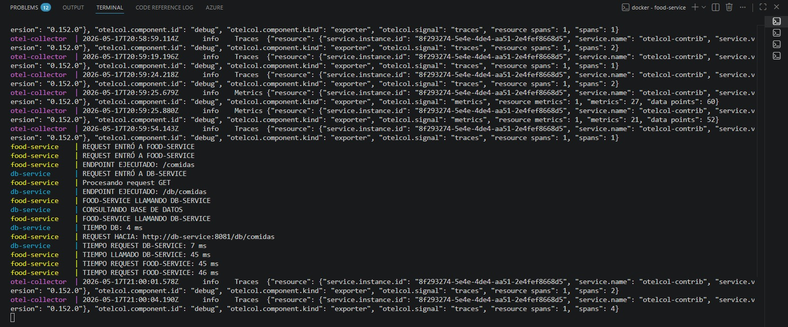

En los logs también se observa el flujo completo entre servicios, incluyendo la entrada al `food-service`, la llamada al `db-service`, la consulta a la base de datos y los tiempos registrados durante la ejecución.

---

## 5.3. ¿Cuál span falló?

Los spans fallidos son identificados mediante manejo de excepciones instrumentado manualmente con OpenTelemetry utilizando:

```java
span.recordException(e);
span.setStatus(StatusCode.ERROR);
```

Cuando ocurre un error, Jaeger y New Relic muestran automáticamente el span con estado `ERROR`, permitiendo identificar exactamente en qué servicio y operación ocurrió la falla.

En las pruebas actuales no se registraron errores significativos. New Relic reportó un `Average error rate` de `0%` para las transacciones monitoreadas. Por lo tanto, no se evidenció un span fallido durante estas ejecuciones.

### Evidencia en New Relic

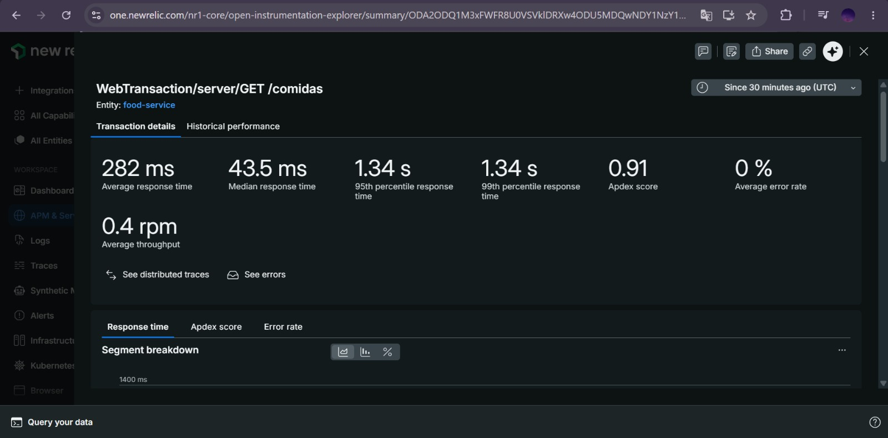

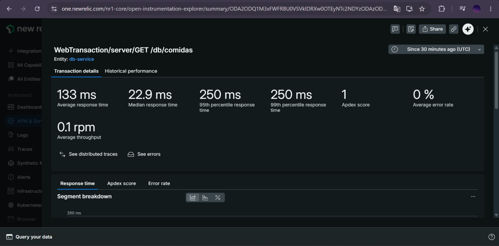

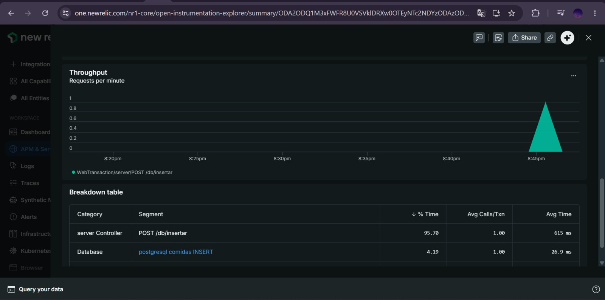

Las evidencias muestran una tasa promedio de error de `0%`. Cuando se implemente una prueba de error controlado, el span fallido podrá visualizarse en Jaeger o New Relic con estado `ERROR`.

---

## 5.4. ¿Qué operación generó latencia?

La operación que generó mayor latencia dentro del flujo fue el procesamiento del endpoint `GET /comidas` en `food-service`, seguido por la llamada externa hacia `db-service`.

En New Relic, para la transacción `GET /comidas`, se observó el siguiente desglose:

```plaintext
GET /comidas: 53.66% del tiempo, 98.5 ms promedio
db-service - all: 46.34% del tiempo, 85 ms promedio
```

### Evidencia en New Relic - food-service

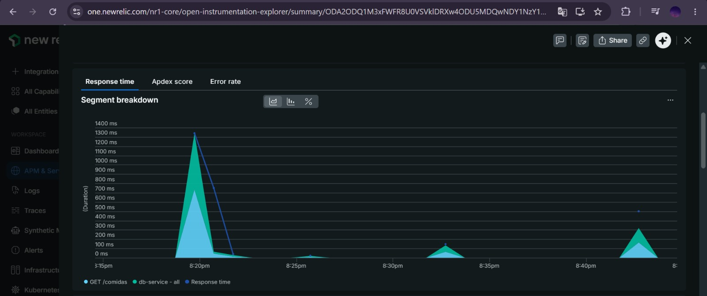

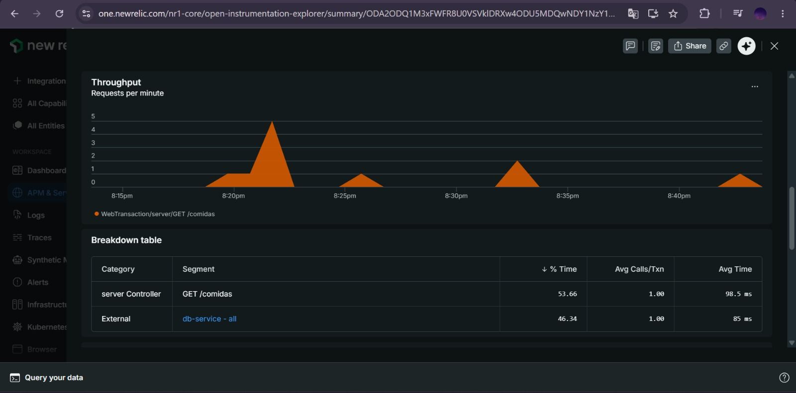

Esto indica que la latencia no depende únicamente de la consulta SQL, sino también del procesamiento del controlador y de la comunicación HTTP entre microservicios.

En `db-service`, para la operación `GET /db/comidas`, New Relic mostró:

```plaintext
GET /db/comidas: 76.39% del tiempo, 47.1 ms promedio
postgresql comidas SELECT: 22.10% del tiempo, 13.6 ms promedio
```

### Evidencia en New Relic - db-service /db/comidas

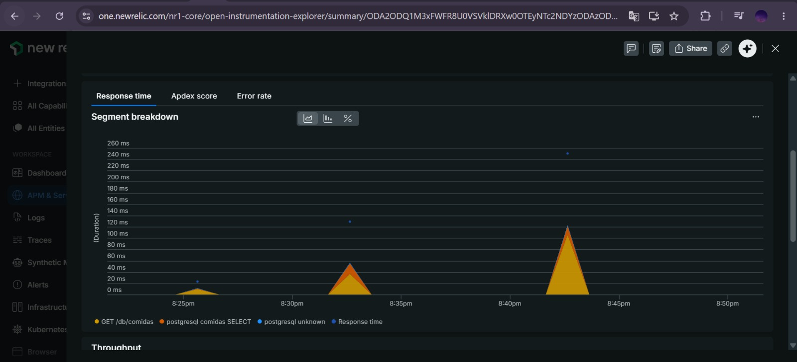

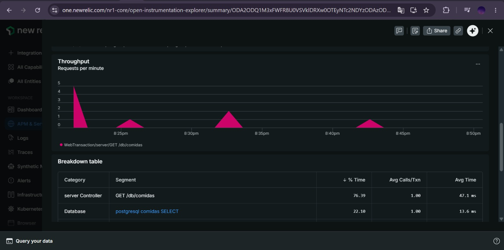

Para la operación de inserción `POST /db/insertar`, se observó que la mayor parte del tiempo estuvo asociada al controlador del servicio:

```plaintext
POST /db/insertar: 95.70% del tiempo, 615 ms promedio
postgresql comidas INSERT: 4.19% del tiempo, 26.9 ms promedio
```

### Evidencia en New Relic - db-service /db/insertar

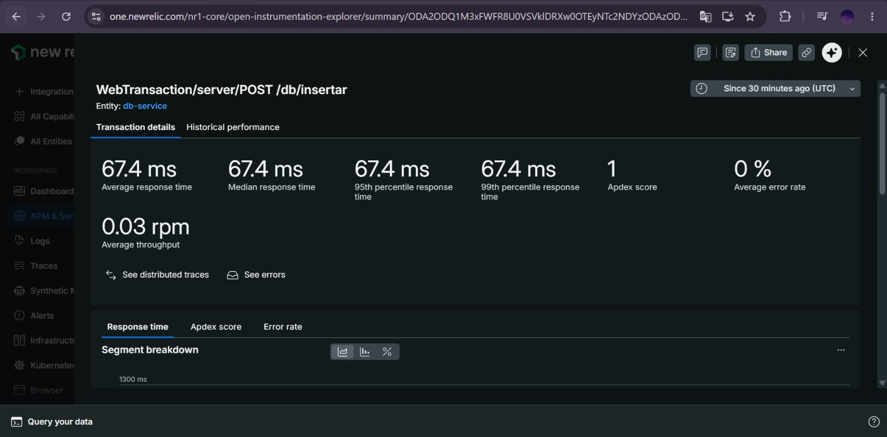

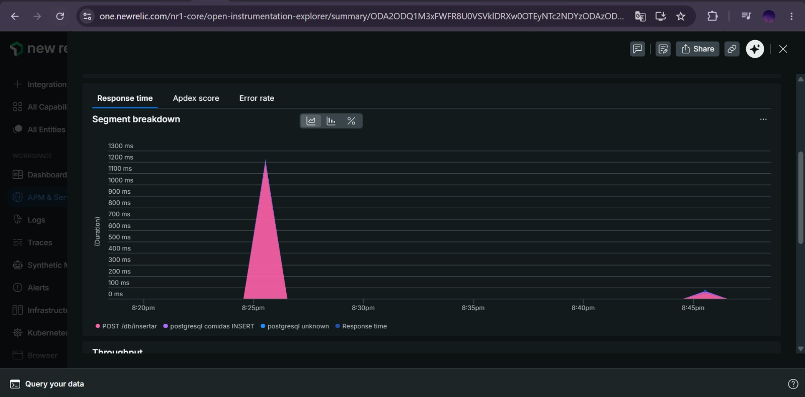

---

## 5.5. ¿Cuántos requests por segundo existen?

En New Relic se visualizaron métricas de throughput mediante `Requests per minute (RPM)`.

Para la transacción principal `GET /comidas` en `food-service`, se observó:

```plaintext
0.4 rpm
```

Convertido a requests por segundo:

```plaintext
0.4 / 60 = 0.0067 requests por segundo
```

Esto corresponde a una carga baja, ya que las pruebas fueron manuales y no una prueba de carga masiva. Sin embargo, permite comprobar que New Relic está recibiendo y graficando correctamente el throughput del endpoint principal.

También se observaron métricas en `db-service`:

```plaintext
GET /db/comidas: 0.1 rpm
POST /db/insertar: 0.03 rpm
```

### Evidencia en New Relic - food-service


### Evidencia en New Relic - db-service /db/comidas


### Evidencia en New Relic - db-service /db/insertar


---

## 5.6. ¿Cuál es el percentil p95?

El percentil p95 obtenido en New Relic para la transacción principal `WebTransaction/server/GET /comidas` en `food-service` fue:

```plaintext
1.34 s
```

Esto significa que el 95% de las solicitudes observadas tuvieron un tiempo de respuesta menor o igual a `1.34 s`.

New Relic también reportó para esta transacción:

```plaintext
Average response time: 282 ms
Median response time: 43.5 ms
99th percentile response time: 1.34 s
Average error rate: 0%
Average throughput: 0.4 rpm
```

### Evidencia en New Relic - food-service


Para `db-service`, se observaron los siguientes valores:

```plaintext
GET /db/comidas:
Average response time: 133 ms
Median response time: 22.9 ms
p95: 250 ms
p99: 250 ms
Average error rate: 0%

POST /db/insertar:
Average response time: 67.4 ms
Median response time: 67.4 ms
p95: 67.4 ms
p99: 67.4 ms
Average error rate: 0%
```

### Evidencia en New Relic - db-service /db/comidas


### Evidencia en New Relic - db-service /db/insertar


## 5.7. ¿Cuál servicio consume más memoria?

El servicio que consume más memoria es `db-service`.

Esto se verificó utilizando el endpoint de métricas de Spring Boot Actuator:

```http
/actuator/metrics/jvm.memory.used
```

Los valores obtenidos fueron:

### db-service

```plaintext
196608504 bytes
≈ 196 MB
```

### food-service

```plaintext
147724416 bytes
≈ 148 MB
```

Por lo tanto, el `db-service` presenta un mayor consumo de memoria. Esto ocurre debido a que:

* Mantiene la conexión activa con PostgreSQL.
* Ejecuta consultas JDBC.
* Procesa objetos provenientes de la base de datos.
* Maneja operaciones SQL instrumentadas con OpenTelemetry.

### Evidencia db-service

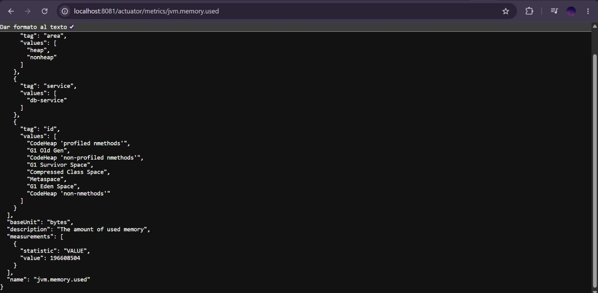

### Evidencia food-service


## 5.8. ¿Cuál endpoint tiene más errores?

Los endpoints monitoreados fueron:

```http
GET /comidas
POST /insertar
GET /db/comidas
POST /db/insertar
```

Durante las pruebas realizadas no se registraron errores HTTP significativos. New Relic reportó:

```plaintext
GET /comidas: 0% average error rate
GET /db/comidas: 0% average error rate
POST /db/insertar: 0% average error rate
```

Por lo tanto, con las pruebas actuales no existe un endpoint con mayor cantidad de errores, ya que todos los endpoints observados presentan una tasa de error de `0%`.

### Evidencia en New Relic


No obstante, en caso de ocurrir errores, estos quedarían automáticamente asociados al endpoint correspondiente mediante:

* TraceId
* SpanId
* HTTP Status
* Logs correlacionados
* Spans con estado ERROR
